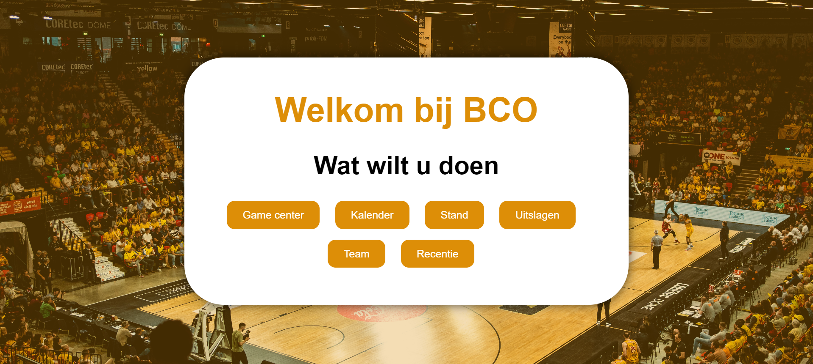
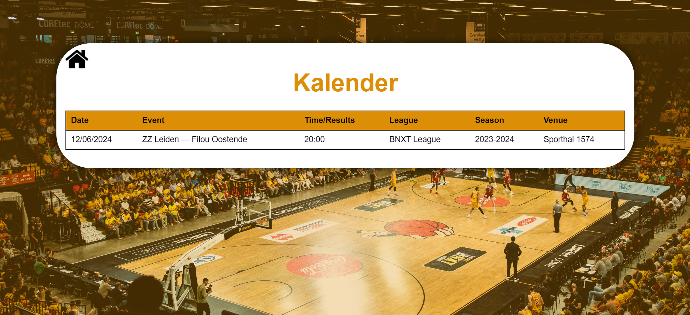
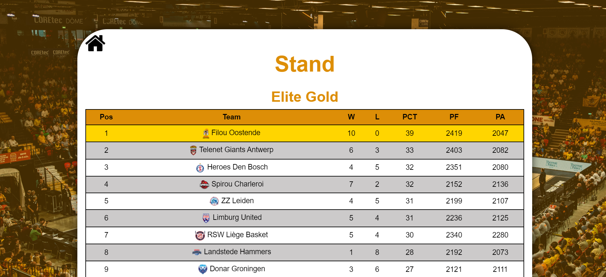
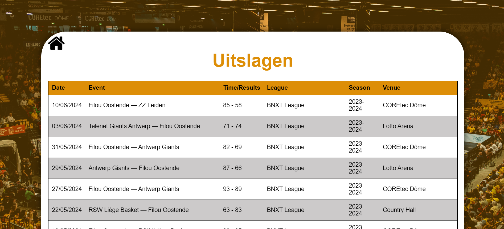
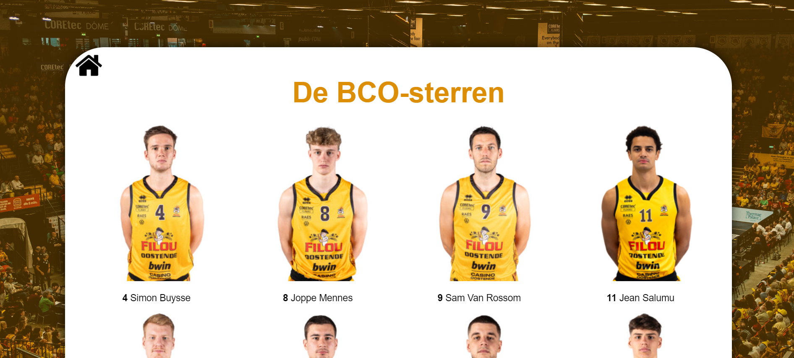

# Portaal

Deze applicatie in ontwikkeld in opdracht van FIlou Oostende in het kader van mijn stage & bachelorproef van de opleiding Toegepaste informatica, applicatie ontwikkeling specialisatie software development aan de hogeschool Vives te Kortrijk

## Probleemstelling

De entertainmentsector is een heel concurrentiële markt. Het wordt moeilijker en moeilijker om op professionele wijze in de entertainmentsector te blijven. Heel veel aandacht gaat naar de grootste, denk bijvoorbeeld aan het voetbal en grote zangers zoals Taylor Swift. Daarnaast is er ook een opmars van evenementen die worden georganiseerd door vrijwilligers. Bijna elke wijk heeft wel een buurtfeest, of enorm veel mensen zitten in muziekgroepjes, sportverenigingen, ... Ook geven deze veel concerten waar mensen graag naar toe gaan. Zoals u ziet is het niet zo vanzelfsprekend om in de entertainmentsector te werken.
Daarom moeten de fans die komen zo goed mogelijk geëntertained worden. Op deze manier is de kans groter dat mensen terugkomen.

## Oplossing

Dit portaal biedt een mooie extra entertainement dat bijna geen enkele andere club heeft. Dit zorgt voor een net extra ervaring. Samen met verschillende andere alternatieven zorgt dit ervoor dat de Oostendse basketbalploeg net boven de andere uitsteekt.

## Wat biedt dit portaal?

Op dit portaal staat verschillende informatie over het eerste team, fotos van spelers,  kalender, stand, uitslagen, ... Allemaal info dat ook online terug te vinden staat. Om dit portaal toch uniek te maken zijn er verscheidene BCO-spelletjes ontwikkeld (BCO staat voor **B**asket**C**lub**O**ostende). Deze games zijn enkel hier op te maken en zijn gelinkt aan de basketclub.

## Alle schermen

Houdt rekening dat deze applicatie is ontwikkeld voor op een grote touchscreen. Om deze reden is er op zoveel mogelijk voorzien dat er niet gescrolled moet worden. Het is namelijk mooier om dit vlak te houden. Ook bekijk je deze website het best in fullscreen (druk f11). Als dingen niet mooi geschikt staan op uw computer is dit omdat uw computer een andere verhouding heeft dan het scherm waarvoor dit ontwikkeld is.

### Homescherm

Zo ziet het homescherm eruit. Zoals u ziet is dit enkel de navigatie. Op de achtergrond staat een afbeelding van tijdens een match, elke keer deze pagina wordt geopend is dit een random afbeelding uit static/Photo/Sfeer. Hierboven staat een oranje filter geprogrammeerd. Tot slot is er ook natuurlijk ook de tile met alles van navigatie.

### Teamgedeelte

Eerst gaan we verder in op het teamgedeelte. Met het teamgedeelte wordt alle linken bedoeld die je op het homescherm ziet behalve gamcenter (m.a.w. Kalender, Stand, Uitslagen, Team en recenties). Recenties hoordt hier niet echt bij maar nemen we toch tesamen voor het gemak.

#### Kalender

Momenteel staat hier slecht één match. Dit is doordat het seizoen op het einde loopt. In de maanden augustus/september zullen hier meer dan 30 matchen staan. Deze informatie wordt gescraped van [de website van basket Oostende](https://bcoostende.be/event/speelkalender-2023-2024/). Deze applicatie is voor hen ontwikkeld en er is hier toestemming voor gevraagd.

#### Stand

De stand is vanzelfsprekend. De eerste staat in een geelkleur deze er te laten uitspringen. Deze springt eruit doordat deze op de kampioenplaats staat. Deze informatie wordt ook gescareped van [de website van basket Oostende](https://bcoostende.be/uitslagen/elite-gold/).

#### Uitslagen

Het scherm uitslagen is bijna identiek aan kalender. Alleen staat hier de einduitslag al ingevuld. Deze informatie wordt ook gescareped van [de website van basket Oostende](https://bcoostende.be/wedstrijd-uitslagen/).

#### Team

Dit scherm toond alle spelers en staff van het eerste team. Dit is inclusief de spelers, nummer en de naam.
